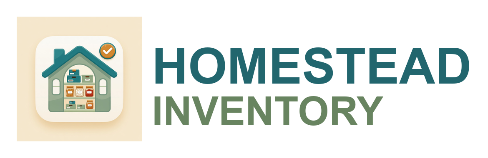

<p align="center">
  
</p>

<h1 align="center">Homestead Inventory</h1>

<p align="center">
  A home inventory manager for Home Assistant with a dedicated sidebar panel —
  <b>Rooms &rarr; Cupboards &rarr; Shelves &rarr; Organizers &rarr; Items</b> —
  photos, quantity tracking, low-stock automations, and printable QR location
  labels. 100% local. No cloud, no telemetry.
</p>

---

## What this is

Homestead Inventory merges two excellent MIT-licensed projects:

- The **polished panel UI** and location hierarchy of
  [Home Inventory](https://github.com/SnipsC0/Home-Inventory) (SnipsC0).
- A **hardened, async storage backend** in the spirit of
  [Simple Inventory](https://github.com/blaineventurine/simple_inventory)
  (Blaine Venturine).

The goal: keep the interface you like, on a backend built for safety and
stability. See [NOTICE](NOTICE) for attribution.

## Why the backend is safer

| Concern | How it's handled |
| --- | --- |
| **Referential integrity** | `PRAGMA foreign_keys = ON` on every connection, so `ON DELETE CASCADE` actually fires. Deleting a room/cupboard/shelf cleanly removes its descendants — no orphaned rows. |
| **Concurrency** | A single persistent `aiosqlite` connection serialized behind one async lock, plus WAL + `busy_timeout`. No "database is locked" under the 1-minute sensor poll. |
| **Upgrades** | Explicit schema versioning + a migration path, so your data survives future changes. |
| **Image security** | Images are served behind HA auth and handed to the browser as **signed, expiring URLs** (`async_sign_path`) — your access token never appears in an image URL, the DOM, logs, or browser history. |
| **Uploads** | Size-capped before buffering, validated as real images (Pillow) and re-encoded to JPEG. Malformed payloads are rejected, never stored. |
| **Privacy** | Local by default — QR codes generated on-device, no telemetry. The only outbound call is the **opt-in** barcode product lookup (off by default). |

## Features

- Dedicated **sidebar panel** with a fast, card-based UI.
- Five-level hierarchy: Rooms &rarr; Cupboards &rarr; Shelves &rarr; Organizers &rarr; Items.
- Per-item **photos**, aliases, quantity + minimum-threshold tracking.
- **Low-stock events** for automations (notifications, shopping lists, etc.).
- **QR location labels**: print a QR for a cupboard, stick it on the real one;
  scanning it opens the panel right at that location to add/adjust items.
- **Barcode support** (v0.2.0): store a barcode per item, scan one with the
  device camera when adding/editing, and **scan-to-find** an item from the Rooms
  view. See notes below.
- Three **sensors**: total items, low stock (with item list), tracked items.

## Barcode scanning

- **Store & scan**: each item has an optional barcode. Type it, or tap **📷 Scan**
  in the add/edit dialog to read it with the camera.
- **Scan to find**: the **📷 Scan** button on the Rooms screen reads a barcode and
  jumps straight to the matching item.
- **Camera requires a secure context.** Browsers only allow camera access over
  **HTTPS or localhost** (e.g. Nabu Casa, an HTTPS reverse proxy, or the Companion
  app). Over plain `http://<ip>:8123` the scanner is unavailable — manual barcode
  entry still works everywhere.
- **Optional product lookup** (off by default): enable *"barcode product lookup"*
  in the integration options to auto-fill an item name from a scanned barcode via
  [Open Food Facts](https://world.openfoodfacts.org). This is the **only** outbound
  network call the integration ever makes; leave it off to stay 100% local.

## Installation

### HACS (custom repository)
1. HACS &rarr; Integrations &rarr; ⋮ &rarr; **Custom repositories**.
2. Add this repo URL, type **Integration**.
3. Install, then **restart Home Assistant**.
4. Settings &rarr; Devices & Services &rarr; **Add Integration** &rarr; "Homestead Inventory".

### Manual
1. Copy `custom_components/homestead_inventory/` to `<config>/custom_components/`.
2. Restart Home Assistant and add the integration.

A **Homestead Inventory** item appears in the sidebar — no extra card to install.

## Sensors & events

Sensors: `sensor.homestead_inventory_total_items`,
`sensor.homestead_inventory_low_stock`,
`sensor.homestead_inventory_tracked_items`.

Events on the HA bus: `homestead_inventory_low_stock`,
`homestead_inventory_item_consumed`.

The low-stock / tracked sensors carry the matching item list as a state
attribute (capped at 200 to bound size). If you have a large inventory and
don't want that history recorded, exclude them from the recorder:

```yaml
recorder:
  exclude:
    entities:
      - sensor.homestead_inventory_low_stock
      - sensor.homestead_inventory_tracked_items
```

```yaml
automation:
  - alias: Low stock to shopping list
    trigger:
      - platform: event
        event_type: homestead_inventory_low_stock
    action:
      - service: shopping_list.add_item
        data:
          name: "{{ trigger.event.data.name }}"
```

## Development

Backend tests (no Home Assistant required):

```bash
pip install -r requirements-dev.txt
pytest -q
```

Rebuild the frontend panel after changing anything in `frontend/`:

```bash
cd frontend
npm install
npm run build   # emits custom_components/homestead_inventory/panel/panel-wrapper.js
```

## License

[MIT](LICENSE). Built on the MIT-licensed Home Inventory and Simple Inventory
projects — see [NOTICE](NOTICE).
